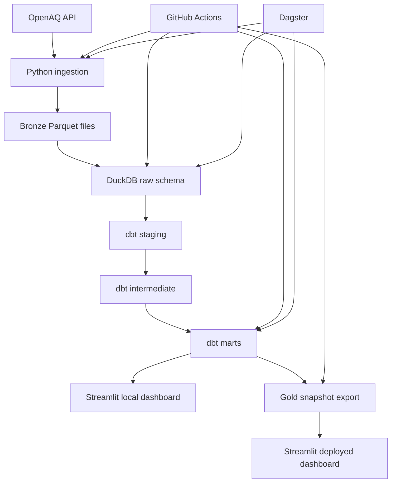

# AirPulse Project Manual

## A detailed guide to the architecture, workflow, and engineering decisions

This manual is the deeper companion to `README.md`. The README is the quick professional overview. This file explains the project in slower, easier English: what each layer does, why it exists, and how data moves from the OpenAQ API into the final Streamlit dashboard.

## Table of Contents

1. [Project Summary](#1-project-summary)
2. [The Business Problem](#2-the-business-problem)
3. [End-to-End Architecture](#3-end-to-end-architecture)
4. [Tech Stack](#4-tech-stack)
5. [Repository Map](#5-repository-map)
6. [Pipeline Deep Dive](#6-pipeline-deep-dive)
7. [Scheduled Refresh Workflow](#7-scheduled-refresh-workflow)
8. [Dashboard Workflow](#8-dashboard-workflow)
9. [Testing Strategy](#9-testing-strategy)
10. [Important Engineering Decisions](#10-important-engineering-decisions)
11. [Real Issues Found and Fixed](#11-real-issues-found-and-fixed)
12. [How to Run the Project](#12-how-to-run-the-project)
13. [Interview Explanation](#13-interview-explanation)
14. [Glossary](#14-glossary)

## 1. Project Summary

AirPulse is an end-to-end data engineering project for global air-quality intelligence.

In simple words:

```text
AirPulse pulls air pollution data,
cleans it,
calculates AQI,
stores dashboard-ready tables,
and shows the result in a Streamlit app.
```

The source is the OpenAQ API. OpenAQ collects air-quality readings from monitoring stations around the world.

The final output is a dashboard showing:

- which locations have the worst air quality
- which pollutant is causing the risk
- how AQI changes over time
- which locations should appear in an operational alert list

This project is built like a small production data platform, not a single script. It has:

- ingestion
- validation
- raw storage
- SQL transformations
- data quality tests
- orchestration
- CI
- scheduled refresh
- dashboard deployment pattern

## 2. The Business Problem

Imagine a logistics company called Meridian Logistics.

It has delivery workers in many countries. Outdoor air quality affects worker safety. The operations team wants to know:

```text
Where is air quality bad today?
Which cities are getting worse?
Which pollutant is causing the problem?
```

Raw OpenAQ data is not ready for this directly because:

- one API response can contain nested JSON
- different providers report different units
- sensors can be missing data
- API results are paginated
- some sensor readings are dirty or impossible
- the same reading can be pulled more than once

AirPulse solves this by building a clean, tested data pipeline around OpenAQ.

## 3. End-to-End Architecture



The same flow in plain English:

```text
1. Pull data from OpenAQ
2. Save it as bronze Parquet
3. Load it into DuckDB raw tables
4. Use dbt to clean and model the data
5. Export final mart tables as a gold snapshot
6. Show the data in Streamlit
7. Use GitHub Actions to refresh it automatically
```

## 4. Tech Stack

| Layer | Tool | Why it is used |
| --- | --- | --- |
| API source | OpenAQ | Real global air-quality data |
| Ingestion | Python | Flexible and easy for API work |
| API reliability | requests, tenacity | HTTP calls, retries, backoff |
| Schema validation | pydantic | Reject bad API shapes early |
| File storage | Parquet | Efficient columnar data format |
| Warehouse | DuckDB | Local analytical SQL database |
| Transformation | dbt | Tested SQL models and lineage |
| Orchestration | Dagster | Local asset graph and scheduling |
| Dashboard | Streamlit | Fast interactive Python UI |
| Automation | GitHub Actions | CI and scheduled refresh |
| Testing | pytest, dbt tests, AppTest | Tests for code, data, and UI |

The important design idea is separation of responsibility:

```text
Python fetches data.
DuckDB stores/query data.
dbt transforms data.
Streamlit displays data.
GitHub Actions refreshes data.
Dagster orchestrates local runs.
```

## 5. Repository Map

```text
.
├── ingestion/
│   ├── openaq_client.py
│   ├── schemas.py
│   ├── config.py
│   ├── extract_locations.py
│   └── extract_measurements.py
│
├── warehouse/
│   ├── db.py
│   ├── load_raw.py
│   └── export_gold_snapshot.py
│
├── dbt_project/
│   ├── models/staging/
│   ├── models/intermediate/
│   ├── models/marts/
│   ├── macros/
│   ├── snapshots/
│   └── tests/
│
├── orchestration/
│   ├── assets/
│   ├── schedules.py
│   ├── sensors.py
│   ├── asset_checks.py
│   └── definitions.py
│
├── app/
│   ├── streamlit_app.py
│   ├── pages/
│   └── utils/
│
├── data/gold_snapshot/
├── tests/
├── scripts_dev/
└── .github/workflows/
```

## 6. Pipeline Deep Dive

### 6.1 OpenAQ Client

File:

```text
ingestion/openaq_client.py
```

This file handles the difficult parts of talking to OpenAQ:

- API key handling
- pagination
- retries
- 429 rate-limit responses
- temporary server errors
- request pacing

OpenAQ returns data page by page. The client keeps asking for pages until a page comes back shorter than the requested page size.

Example:

```text
Ask page 1 -> 100 records
Ask page 2 -> 100 records
Ask page 3 -> 27 records
Stop, because 27 is less than 100
```

The client also waits between requests so it does not exceed OpenAQ limits.

### 6.2 Schema Validation

File:

```text
ingestion/schemas.py
```

This file defines what valid OpenAQ data should look like.

Example idea:

```text
A location must have an id.
A measurement must have a timestamp.
A measurement value can be null.
```

Why this matters:

```text
Bad data should fail near the source,
not three steps later inside a dashboard.
```

### 6.3 Location Extraction

File:

```text
ingestion/extract_locations.py
```

This pulls monitoring locations from OpenAQ.

The scheduled refresh uses:

```bash
python -m ingestion.extract_locations --limit-locations-per-country 10
```

That means:

```text
For each target country, keep 10 useful locations.
```

The project currently targets:

```text
US, IN, GB, DE, PL, MX, TH, NG
```

The location selection prefers:

- fixed monitors
- non-mobile locations
- recent locations
- moderate sensor counts
- useful pollutant coverage
- not giant sensor-heavy locations

This was added because simply choosing locations with the most sensors caused one location to generate too many measurement API calls.

### 6.4 Measurement Extraction

File:

```text
ingestion/extract_measurements.py
```

This reads the latest location snapshot, finds sensors, and fetches hourly measurements.

The scheduled refresh uses:

```bash
python -m ingestion.extract_measurements --max-sensors-per-location 5
```

That means:

```text
For each selected location, fetch at most 5 useful sensors.
```

Preferred pollutants:

```text
pm25, pm10, no2, o3, so2, co
```

Example:

```text
Location has 200 sensors.
Instead of querying all 200,
AirPulse chooses a diverse top 5.
```

This protects the workflow from becoming too slow.

### 6.5 Bronze Layer

Bronze files are saved under:

```text
data/bronze/
```

Example:

```text
data/bronze/locations/ingest_date=2026-07-08/locations.parquet
data/bronze/measurements/ingest_date=2026-07-08/measurements.parquet
```

Bronze means:

```text
Data is close to what the API returned.
It is saved for traceability.
It is not deeply cleaned yet.
```

Bronze data is gitignored because it can be regenerated from OpenAQ.

### 6.6 Raw DuckDB Layer

File:

```text
warehouse/load_raw.py
```

This loads bronze Parquet into DuckDB:

```text
raw.locations
raw.measurements
```

Run:

```bash
python -m warehouse.load_raw
```

Important design choice:

```text
The raw loader does not clean data.
It just loads data.
```

Why?

Because cleaning rules should live in one place: dbt.

### 6.7 dbt Staging Layer

Folder:

```text
dbt_project/models/staging/
```

Staging models:

- rename columns
- cast data types
- flatten nested fields
- deduplicate overlapping pulls
- handle invalid source values

Example:

```text
If the same sensor-hour appears twice,
keep the most recently ingested copy.
```

Another example:

```text
If OpenAQ returns a negative concentration,
turn it into null in staging.
```

Negative concentration is physically impossible, so it should not create invalid AQI.

### 6.8 dbt Intermediate Layer

Folder:

```text
dbt_project/models/intermediate/
```

This layer handles calculations:

- unit normalization
- AQI-unit conversion
- AQI calculation

Unit problem example:

```text
One sensor reports ozone in ppm.
Another reports ozone in µg/m³.
They cannot be compared directly.
```

The macros convert units consistently.

### 6.9 dbt Marts Layer

Folder:

```text
dbt_project/models/marts/
```

This is the final analytics layer.

Important tables:

```text
mart.fact_air_quality_hourly
mart.fact_daily_city_aqi
mart.dim_location
mart.dim_pollutant
mart.dim_date
```

The dashboard mainly reads:

```text
mart.fact_daily_city_aqi
```

because it is already summarized and fast.

### 6.10 Gold Snapshot

File:

```text
warehouse/export_gold_snapshot.py
```

This exports mart tables to:

```text
data/gold_snapshot/
```

The deployed Streamlit app uses this snapshot.

Why?

Because Streamlit Community Cloud does not run your local DuckDB database or Dagster process.

So the deployed app reads:

```text
committed Parquet snapshot
```

instead of:

```text
live local database
```

## 7. Scheduled Refresh Workflow

File:

```text
.github/workflows/scheduled_refresh.yml
```

This workflow runs every 6 hours and can also be triggered manually.

It does:

```text
1. install dependencies
2. pull fresh OpenAQ locations
3. pull fresh OpenAQ measurements
4. load raw DuckDB tables
5. run dbt build
6. export gold snapshot
7. commit refreshed snapshot back to GitHub
```

The key commands:

```bash
python -m ingestion.extract_locations --limit-locations-per-country 10
python -m ingestion.extract_measurements --max-sensors-per-location 5
python -m warehouse.load_raw
dbt build
python -m warehouse.export_gold_snapshot
```

The workflow needs one GitHub secret:

```text
OPENAQ_API_KEY
```

GitHub stores this secret securely. The key is not committed to the repo.

## 8. Dashboard Workflow

Folder:

```text
app/
```

The dashboard has three pages:

```text
Home
City Trends
Alerts
```

### Home

File:

```text
app/streamlit_app.py
```

Shows:

- number of monitored locations
- worst AQI
- zones needing attention
- map
- leaderboard

### City Trends

File:

```text
app/pages/1_City_Trends.py
```

Lets the user pick:

```text
location + pollutant
```

and see AQI history.

### Alerts

File:

```text
app/pages/2_Alerts.py
```

Shows a watch list of locations above a selected risk level.

### Data Access

File:

```text
app/utils/data.py
```

This file chooses between two modes:

| Mode | When | Data source |
| --- | --- | --- |
| Live | local machine has `airpulse.duckdb` | DuckDB mart tables |
| Snapshot | deployed app or no DuckDB file | `data/gold_snapshot/*.parquet` |

This makes one Streamlit app work both locally and in deployment.

## 9. Testing Strategy

The project tests each layer with the right tool.

| Layer | Test type | Purpose |
| --- | --- | --- |
| OpenAQ client | pytest mocks | pagination, retry, rate-limit behavior |
| Schemas | pytest | OpenAQ response validation |
| Ingestion | pytest integration | writes valid bronze Parquet |
| Raw load | pytest + temp DuckDB | loads bronze into raw tables |
| dbt | dbt tests | data quality and relationships |
| Dagster | pytest | full asset graph materializes |
| Streamlit | AppTest | pages render and show correct values |

Current verification:

```text
35 pytest tests passing
Ruff passing
Black passing
dbt tests covered by integration builds
```

## 10. Important Engineering Decisions

### Raw stays raw

The raw loader does not clean data.

Reason:

```text
If cleaning rules are spread across Python and SQL,
the system becomes hard to reason about.
```

So cleaning belongs in dbt.

### dbt build instead of dbt run

`dbt run` builds models only.

`dbt build` runs:

```text
models + snapshots + tests
```

That is why the workflow uses `dbt build`.

### Snapshot-backed Streamlit deployment

The deployed app does not query OpenAQ directly.

Reason:

```text
Dashboards should be fast and stable.
API ingestion should happen in scheduled jobs.
```

So GitHub Actions refreshes `data/gold_snapshot/`, and Streamlit reads that.

### Optimized OpenAQ refresh

The first version queried too many sensors.

The optimized version uses:

```bash
--limit-locations-per-country 10
--max-sensors-per-location 5
```

This keeps:

- country coverage
- pollutant diversity
- reliable runtime
- lower API pressure

### Negative source values become null

OpenAQ can return dirty real-world readings.

If a concentration is negative:

```text
That value is impossible.
Keep the row for lineage.
Set value to null for analytics.
```

This prevents invalid AQI.

## 11. Real Issues Found and Fixed

### 1. Null value became AQI 500

Problem:

```text
SQL NULL comparisons do not behave like normal booleans.
```

A missing reading accidentally fell through the AQI formula and became `500`, which means Hazardous.

Fix:

```text
If value is null, AQI is null.
```

### 2. Incremental raw load expected a missing column

Problem:

```text
Incremental mode depended on ingest_date,
but full refresh had not created it correctly.
```

Fix:

```text
Use DuckDB hive partition inference from ingest_date=YYYY-MM-DD folders.
```

### 3. Optional fields broke flattening

Problem:

If all rows missed an optional nested field, pandas did not create the expected flattened columns.

Fix:

```text
Serialize optional nested objects as objects with null fields.
```

### 4. Fresh Streamlit run could crash

Problem:

If mart tables did not exist yet, DuckDB raised a catalog error.

Fix:

```text
Return an empty DataFrame and show a friendly no-data message.
```

### 5. Streamlit could not import `app`

Problem:

When running:

```bash
streamlit run app/streamlit_app.py
```

Python sometimes could not find the top-level `app` package.

Fix:

```text
Add project root to sys.path at Streamlit entrypoints.
```

### 6. Sensor-heavy locations made refresh slow

Problem:

Choosing locations by maximum sensor count selected stations with hundreds of sensors.

Fix:

```text
Prefer moderate sensor coverage and cap selected sensors per location.
```

### 7. Live OpenAQ returned negative measurements

Problem:

dbt tests failed because OpenAQ returned impossible negative concentrations.

Fix:

```text
Convert negative values to null in staging.
```

## 12. How to Run the Project

### Setup

```bash
python -m venv .venv
source .venv/bin/activate
pip install -r requirements.txt
cp .env.example .env
```

Add your OpenAQ key to `.env`:

```text
OPENAQ_API_KEY=your-key-here
```

### Fast local pipeline

```bash
python -m ingestion.extract_locations --limit-locations-per-country 10
python -m ingestion.extract_measurements --max-sensors-per-location 5
python -m warehouse.load_raw
```

Then:

```bash
cd dbt_project
cp profiles.yml.example profiles.yml
export DBT_PROFILES_DIR=$(pwd)
dbt build
cd ..
```

Export dashboard snapshot:

```bash
python -m warehouse.export_gold_snapshot
```

Run dashboard:

```bash
streamlit run app/streamlit_app.py
```

### Run tests

```bash
python -m pytest tests/ -v
python -m ruff check app ingestion orchestration scripts_dev tests warehouse
python -m black --check --line-length 110 app ingestion orchestration scripts_dev tests warehouse
```

### Run Dagster locally

```bash
export PYTHONPATH=.
export DAGSTER_HOME=.dagster_home
mkdir -p "$DAGSTER_HOME"
dagster dev -m orchestration.definitions
```

## 13. Interview Explanation

Short version:

> AirPulse is an end-to-end air-quality data pipeline. It ingests OpenAQ data with Python, validates it with pydantic, stores raw Parquet, loads DuckDB raw tables, transforms the data with dbt into AQI fact and dimension marts, refreshes snapshots through GitHub Actions, and serves the final data through a Streamlit dashboard.

More detailed version:

> I designed it with production-style layers: ingestion, bronze storage, raw warehouse, staging, intermediate models, marts, orchestration, CI, and deployment. I used dbt for transformation and testing, DuckDB as a local warehouse, Dagster for asset orchestration, and GitHub Actions for scheduled refresh. The deployed dashboard reads a committed gold snapshot, so it does not depend on live API calls or a running database.

Tradeoff explanation:

> AQI is calculated from hourly readings as an approximation. A regulatory AQI system would use official rolling windows, such as 24-hour PM averages and 8-hour ozone averages. I documented this as a known simplification.

Optimization explanation:

> To keep scheduled refreshes reliable, I select useful locations per country and cap sensors per location. That preserves geographic and pollutant coverage without overwhelming OpenAQ or GitHub Actions.

## 14. Glossary

| Term | Meaning |
| --- | --- |
| API | A way for one program to request data from another program |
| OpenAQ | Public air-quality data API |
| AQI | Air Quality Index, a 0-500 risk score |
| Bronze | Raw-ish files saved from the source |
| Raw schema | Bronze data loaded into database tables |
| Staging | Cleaned and standardized source-shaped data |
| Intermediate | Transformation layer for calculations |
| Mart | Final analytics-ready tables |
| Fact table | Table of events or measurements |
| Dimension table | Table of descriptive attributes |
| Parquet | Efficient columnar file format |
| DuckDB | Local analytical SQL database |
| dbt | Tool for SQL transformations and tests |
| Snapshot | Saved point-in-time version of data |
| SCD Type 2 | Method for tracking historical dimension changes |
| Dagster | Data orchestration tool |
| Streamlit | Python web app framework |
| GitHub Actions | GitHub automation/CI system |
| Pydantic | Python data validation library |
| Regression test | Test that prevents a known bug from returning |

