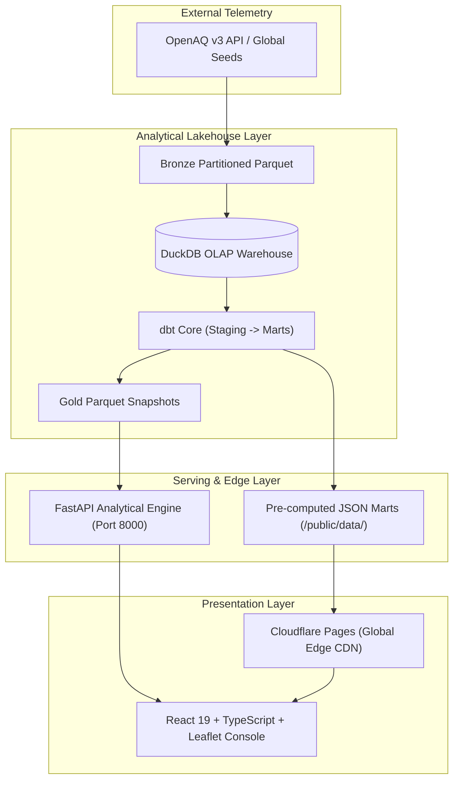

# AirPulse: Global Air Quality Risk Intelligence

[](https://opensource.org/licenses/MIT)
[]()
[](https://www.python.org/)
[](https://duckdb.org/)
[](https://www.getdbt.com/)
[](https://fastapi.tiangolo.com/)
[](https://pages.cloudflare.com/)

AirPulse is an end-to-end, open-source data engineering platform that ingests global atmospheric telemetry from the OpenAQ API, stores raw partitions in a bronze Parquet lakehouse, transforms data using DuckDB and dbt Core with SCD Type 2 tracking, and serves a high-performance React + Leaflet operational risk console.

Designed as an enterprise-grade decision support system, AirPulse features **Freight & Flight Route Risk Corridor Triage** for aviation dispatchers, cargo operators, and supply chain managers evaluating atmospheric chokepoints and ground safety advisories worldwide.

## Key Capabilities

- **Freight & Flight Route Corridor Triage**: Spherical Great-Circle geodesic distance calculations ($km$ and $NM$), 40 waypoint flight-path interpolation, and automated ramp crew PPE advisories between 26 global hubs.
- **Geospatial Risk Telemetry**: Interactive Leaflet world map color-coded by EPA AQI risk tiers with dynamic sizing.
- **SCD Type 2 Dimensional Modeling**: Tracks historical station configurations, coordinates, and validity windows across 6 continents.
- **Hourly Trend Drilldowns**: Multi-pollutant analysis ($PM_{2.5}$, $PM_{10}$, $O_3$, $NO_2$) across 48-hour monitoring windows.
- **Operational Alerts & Export**: Filtered risk triage feeds with one-click CSV export for dispatchers.
- **Dual-Mode Deployment**: Runs as a full-stack local FastAPI application or as a **100% free, zero-maintenance Jamstack app on Cloudflare Pages**.

## Architecture



## Tech Stack

| Layer | Technology | Purpose |
| --- | --- | --- |
| **Source** | OpenAQ v3 API | Worldwide air-quality measurements across 26 international hubs |
| **Ingestion** | Python, requests, tenacity, pydantic | API extraction, rate-limit backoff, schema validation |
| **Storage** | Parquet, DuckDB | Partitioned bronze storage & embedded columnar OLAP warehouse |
| **Transformation** | dbt Core, dbt-duckdb | Dimensional modeling, SCD Type 2 tracking, data quality tests |
| **Orchestration** | Dagster / Pipeline Runner | Asset dependency graph, automated batch execution |
| **API Backend** | FastAPI, Uvicorn, Pandas | High-concurrency REST endpoints, Swagger documentation |
| **Frontend** | React, TypeScript, Vite, Tailwind, Leaflet | Geospatial flight corridor maps & telemetry console |
| **Edge Hosting** | Cloudflare Pages, GitHub Actions | Zero-cost static CDN hosting with automated CI/CD data refresh |
| **Quality** | pytest (57 tests), dbt tests, oxlint | Unit, schema, integration, and end-to-end pipeline verification |

## Quickstart (Local Development)

### 1. Run Everything in One Command
```bash
npm run dev
```
Starts both the FastAPI analytical backend (`http://localhost:8000`) and the Vite React console (`http://localhost:5173`) in a single terminal.

### 2. Or Run With Only Python (Zero Node Required)
Because the production bundle is pre-compiled in `frontend/dist`, you can run the entire system with pure Python:
```bash
python -m uvicorn app.api.main:app --port 8000
```
Open **`http://localhost:8000`** in any browser.

---

## Zero-Cost Cloudflare Pages Deployment Guide

AirPulse can be deployed to **Cloudflare Pages** for **100% free forever** with zero server costs:

1. **Fork or Push this repository to your GitHub account**.
2. Go to the [Cloudflare Dashboard](https://dash.cloudflare.com/) > **Workers & Pages** > **Create application** > **Pages** > **Connect to Git**.
3. Select the `airpulse-air-quality-pipeline` repository.
4. Configure Build Settings:
   - **Framework preset**: `Vite`
   - **Build command**: `npm run build --prefix frontend`
   - **Build output directory**: `frontend/dist`
5. Click **Save and Deploy**. Your interactive platform will be live globally at `https://<your-project>.pages.dev` in under 60 seconds!

> [!TIP]
> The included GitHub Actions workflow (`.github/workflows/deploy.yml`) runs tests and automatically refreshes analytical data snapshots on a 6-hour cron schedule.

## Repository Structure

```text
.
├── ingestion/                 # OpenAQ client, schemas, location and measurement extraction
├── warehouse/                 # DuckDB connection, raw loader, pipeline runner, snapshot exporter
├── dbt_project/               # staging, intermediate, mart models, macros, tests, snapshots
├── orchestration/             # Dagster assets, schedules, checks, definitions
├── app/                       # FastAPI analytical engine and legacy Streamlit dashboard
├── frontend/                  # React 19 + Leaflet + Tailwind CSS telemetry console
├── data/gold_snapshot/        # Committed mart snapshots for zero-setup portability
├── tests/                     # pytest unit, integration, API, and pipeline tests
├── scripts_dev/               # synthetic bronze & global telemetry seed generators
└── .github/workflows/         # CI and scheduled refresh workflows
```

## Data Pipeline

### 1. Ingest locations

`ingestion/extract_locations.py` pulls location and sensor metadata from OpenAQ.

For scheduled refreshes, it keeps the pipeline fast by selecting useful locations per country:

```bash
python -m ingestion.extract_locations --limit-locations-per-country 10
```

The selection prefers:

- fixed monitoring stations
- non-mobile locations
- recently active locations
- moderate sensor coverage
- locations that avoid huge duplicate sensor lists

### 2. Ingest measurements

`ingestion/extract_measurements.py` reads the latest location snapshot and fetches hourly measurements for selected sensors.

For scheduled refreshes, each location is capped to a diverse set of pollutant sensors:

```bash
python -m ingestion.extract_measurements --max-sensors-per-location 5
```

Preferred pollutants:

```text
pm25, pm10, no2, o3, so2, co
```

This keeps all target countries represented while avoiding thousands of slow API calls from one overly sensor-heavy location.

### 3. Store bronze data

Ingested files land as partitioned Parquet:

```text
data/bronze/locations/ingest_date=YYYY-MM-DD/locations.parquet
data/bronze/measurements/ingest_date=YYYY-MM-DD/measurements.parquet
```

Bronze data is regenerable and gitignored.

### 4. Load raw DuckDB tables

```bash
python -m warehouse.load_raw
```

This creates:

```text
raw.locations
raw.measurements
```

The raw loader intentionally does not clean or deduplicate data. Raw stays raw; transformation logic belongs in dbt.

### 5. Transform with dbt

The dbt project builds a dimensional model:

```text
staging       -> clean, type-cast, flatten, deduplicate
intermediate  -> normalize units, calculate AQI
marts         -> dashboard-ready fact and dimension tables
```

Important mart tables:

```text
mart.fact_air_quality_hourly
mart.fact_daily_city_aqi
mart.dim_location
mart.dim_pollutant
```

Run dbt manually:

```bash
cd dbt_project
cp profiles.yml.example profiles.yml
export DBT_PROFILES_DIR=$(pwd)
dbt build
```

`dbt build` runs models, snapshots, and tests in dependency order.

### 6. Export gold snapshot

```bash
python -m warehouse.export_gold_snapshot
```

This exports final mart tables to:

```text
data/gold_snapshot/
```

The deployed Streamlit app reads this committed snapshot because Streamlit Community Cloud does not have access to your local DuckDB database.

## Web Dashboard & Serving

AirPulse supports two frontend options:
1. **Modern Decoupled Web App (Recommended):** A high-performance FastAPI backend serving a responsive React + TypeScript Single-Page Application with interactive Leaflet mapping, SVG trend charts, and operational alerts.
2. **Legacy Streamlit Dashboard:** Retained for backward compatibility.

### Run Modern Web App (FastAPI + React)

Run in the project root:

```bash
npm run dev
```

This single command starts both:
1. **FastAPI backend** on `http://127.0.0.1:8000` (auto-reloading on Python changes)
2. **Vite React UI** on `http://localhost:5173` (hot module replacement with API proxying)

- **Web Dashboard:** [http://localhost:5173](http://localhost:5173) (or [http://localhost:8000](http://localhost:8000))
- **Interactive API Docs:** [http://localhost:8000/docs](http://localhost:8000/docs)

To run the production build in a single process:
```bash
npm run build
npm start
```

### Run Legacy Streamlit App

```bash
streamlit run app/streamlit_app.py
```

### Pages & Capabilities

- **Global Overview:** Top-line operational KPIs, interactive global station risk map with EPA color codes, and today's most polluted stations leaderboard.
- **City Trends:** Drill into any location and pollutant to inspect hourly AQI progression against EPA reference threshold lines.
- **Operational Alerts:** Instant risk-tier threshold filtering with one-click CSV export for dispatch teams.

The serving layer supports dual data modes:

| Mode | When Used | Source |
| --- | --- | --- |
| Live DuckDB | Running locally with `warehouse/airpulse.duckdb` present | `mart.*` analytical tables |
| Snapshot Fallback | Deployed or without local database file | `data/gold_snapshot/*.parquet` |

This is handled seamlessly in `app/utils/data.py`.

## Setup

Use Python 3.11 or 3.12.

```bash
python -m venv .venv
source .venv/bin/activate
pip install -r requirements.txt
```

Create your local environment file:

```bash
cp .env.example .env
```

Then edit `.env`:

```text
OPENAQ_API_KEY=your-openaq-api-key-here
```

Do not commit `.env`. It is intentionally ignored by Git.

## Run the Pipeline Locally

Fast practical run:

```bash
python -m ingestion.extract_locations --limit-locations-per-country 10
python -m ingestion.extract_measurements --max-sensors-per-location 5
python -m warehouse.load_raw

cd dbt_project
cp profiles.yml.example profiles.yml
export DBT_PROFILES_DIR=$(pwd)
dbt build
cd ..

python -m warehouse.export_gold_snapshot
```

Run the dashboard:

```bash
streamlit run app/streamlit_app.py
```

## Run Tests

```bash
python -m pytest tests/ -v
python -m ruff check app ingestion orchestration scripts_dev tests warehouse
python -m black --check --line-length 110 app ingestion orchestration scripts_dev tests warehouse
```

Current local verification:

```text
35 pytest tests passing
29 dbt data tests covered through integration paths
Ruff passing
Black format check passing
```

## GitHub Actions

### CI

`.github/workflows/ci.yml` runs on every push and pull request to `main`.

It checks:

- Ruff linting
- Black formatting
- full pytest suite

### Scheduled data refresh

`.github/workflows/scheduled_refresh.yml` runs every 6 hours and can also be triggered manually.

It performs:

```text
pull OpenAQ data
load DuckDB raw tables
run dbt build
export gold snapshot
commit refreshed snapshot back to GitHub
```

The refresh uses:

```bash
python -m ingestion.extract_locations --limit-locations-per-country 10
python -m ingestion.extract_measurements --max-sensors-per-location 5
```

This keeps refreshes reliable under OpenAQ rate limits and GitHub Actions runtime constraints.

To enable scheduled refreshes, add this repository secret:

```text
Settings -> Secrets and variables -> Actions -> New repository secret

Name: OPENAQ_API_KEY
Value: your OpenAQ API key
```

## Data Quality

The project includes data quality checks at multiple layers:

- Pydantic validation for OpenAQ API response shapes
- dbt schema tests for keys, relationships, not-null fields, and accepted values
- dbt singular tests for AQI range, duplicate sensor readings, and impossible concentrations
- pytest integration tests for ingestion, raw loading, orchestration, and dashboard rendering

Real-world dirty data is handled intentionally. For example, negative OpenAQ concentration values are converted to null in staging so they do not produce invalid AQI or dashboard aggregates.

## Orchestration With Dagster

Run locally:

```bash
export PYTHONPATH=.
export DAGSTER_HOME=.dagster_home
mkdir -p "$DAGSTER_HOME"
dagster dev -m orchestration.definitions
```

Dagster represents the pipeline as assets:

```text
raw_locations
raw_measurements
raw_schema_loaded
dbt models and snapshots
```

The dbt asset wrapper runs `dbt build`, so models, snapshots, and tests execute in the correct dependency order.

## Deployment

The app can be deployed to Streamlit Community Cloud.

Recommended settings:

```text
Main file: app/streamlit_app.py
Requirements file: app/requirements.txt
```

The deployed app reads `data/gold_snapshot/`, which is refreshed by GitHub Actions.

## Design Decisions

- DuckDB is used as an embedded analytical warehouse to keep the project free and simple.
- dbt owns cleaning, deduplication, unit normalization, AQI calculation, and mart modeling.
- Bronze data is kept raw and regenerable.
- GitHub Actions refreshes a committed gold snapshot for deployment.
- The dashboard avoids live API calls, making it fast and stable.
- Location and sensor selection are capped to preserve country coverage without overwhelming OpenAQ.
- AQI is calculated as an hourly approximation, not a regulatory rolling-window AQI.

## Known Tradeoffs

- AQI uses hourly readings rather than official EPA 8-hour or 24-hour rolling windows.
- Streamlit deployment reads a committed snapshot, not a live database.
- Location metadata joins use the current location dimension rather than full point-in-time SCD2 joins.
- OpenAQ provider data can be inconsistent; the pipeline validates and filters where appropriate.

## Project Status

Complete and working:

- API ingestion
- Bronze Parquet storage
- DuckDB raw warehouse
- dbt dimensional model
- AQI calculation
- Dagster orchestration
- Streamlit dashboard
- GitHub CI
- Scheduled refresh workflow
- Snapshot-based deployment pattern

