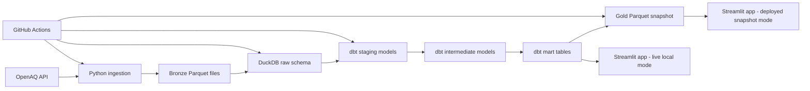

# AirPulse: Global Air Quality Risk Intelligence

[](https://github.com/Rahmman001/airpulse-air-quality-pipeline/actions/workflows/ci.yml)

AirPulse is an end-to-end data engineering project that ingests live air-quality data from the OpenAQ API, stores raw data in a bronze layer, transforms it with DuckDB and dbt, and serves a Streamlit dashboard for operational air-quality risk monitoring.

The project is designed like a small production data platform: API ingestion, schema validation, raw storage, dimensional modeling, data quality tests, orchestration, CI, scheduled refreshes, and a deployable dashboard.

## What It Does

AirPulse answers a practical question:

> Which monitored locations currently have risky air quality, and how is that risk changing over time?

The dashboard shows:

- Current worst AQI readings by location
- Global map of monitored air-quality risk
- City/pollutant trend drilldowns
- Operational alert list for unhealthy locations
- A snapshot-backed deployment mode for Streamlit Community Cloud

## Architecture



## Tech Stack

| Layer | Technology | Purpose |
| --- | --- | --- |
| Source | OpenAQ v3 API | Real global air-quality measurements |
| Ingestion | Python, requests, tenacity, pydantic | API calls, retries, rate-limit handling, schema validation |
| Storage | Parquet, DuckDB | Local lakehouse-style bronze/raw storage |
| Transformation | dbt Core, dbt-duckdb | SQL models, tests, snapshots, documentation |
| Orchestration | Dagster | Local asset graph, scheduling, checks |
| Dashboard | Streamlit, PyDeck, Altair | Interactive air-quality risk UI |
| Automation | GitHub Actions | CI and scheduled data refresh |
| Testing | pytest, dbt tests, Streamlit AppTest | Unit, integration, data quality, dashboard tests |

## Repository Structure

```text
.
├── ingestion/                 # OpenAQ client, schemas, location and measurement extraction
├── warehouse/                 # DuckDB connection, raw loader, gold snapshot export
├── dbt_project/               # staging, intermediate, mart models, macros, tests, snapshots
├── orchestration/             # Dagster assets, schedules, checks, definitions
├── app/                       # Streamlit dashboard and app-only requirements
├── data/gold_snapshot/        # Committed mart snapshot used by deployed Streamlit app
├── tests/                     # pytest integration/unit/dashboard tests
├── scripts_dev/               # synthetic bronze data generator
└── .github/workflows/         # CI and scheduled refresh workflows
```

## Data Pipeline

### 1. Ingest locations

`ingestion/extract_locations.py` pulls location and sensor metadata from OpenAQ.

For scheduled refreshes, it keeps the pipeline fast by selecting useful locations per country:

```bash
python -m ingestion.extract_locations --limit-locations-per-country 10
```

The selection prefers:

- fixed monitoring stations
- non-mobile locations
- recently active locations
- moderate sensor coverage
- locations that avoid huge duplicate sensor lists

### 2. Ingest measurements

`ingestion/extract_measurements.py` reads the latest location snapshot and fetches hourly measurements for selected sensors.

For scheduled refreshes, each location is capped to a diverse set of pollutant sensors:

```bash
python -m ingestion.extract_measurements --max-sensors-per-location 5
```

Preferred pollutants:

```text
pm25, pm10, no2, o3, so2, co
```

This keeps all target countries represented while avoiding thousands of slow API calls from one overly sensor-heavy location.

### 3. Store bronze data

Ingested files land as partitioned Parquet:

```text
data/bronze/locations/ingest_date=YYYY-MM-DD/locations.parquet
data/bronze/measurements/ingest_date=YYYY-MM-DD/measurements.parquet
```

Bronze data is regenerable and gitignored.

### 4. Load raw DuckDB tables

```bash
python -m warehouse.load_raw
```

This creates:

```text
raw.locations
raw.measurements
```

The raw loader intentionally does not clean or deduplicate data. Raw stays raw; transformation logic belongs in dbt.

### 5. Transform with dbt

The dbt project builds a dimensional model:

```text
staging       -> clean, type-cast, flatten, deduplicate
intermediate  -> normalize units, calculate AQI
marts         -> dashboard-ready fact and dimension tables
```

Important mart tables:

```text
mart.fact_air_quality_hourly
mart.fact_daily_city_aqi
mart.dim_location
mart.dim_pollutant
mart.dim_date
```

Run dbt manually:

```bash
cd dbt_project
cp profiles.yml.example profiles.yml
export DBT_PROFILES_DIR=$(pwd)
dbt build
```

`dbt build` runs models, snapshots, and tests in dependency order.

### 6. Export gold snapshot

```bash
python -m warehouse.export_gold_snapshot
```

This exports final mart tables to:

```text
data/gold_snapshot/
```

The deployed Streamlit app reads this committed snapshot because Streamlit Community Cloud does not have access to your local DuckDB database.

## Dashboard

Run locally:

```bash
streamlit run app/streamlit_app.py
```

Pages:

- Home: KPIs, global AQI risk map, top polluted locations
- City Trends: location/pollutant AQI history
- Alerts: operational watch list for unhealthy locations

The app has two data modes:

| Mode | When Used | Source |
| --- | --- | --- |
| Live DuckDB | Running locally with `airpulse.duckdb` present | `mart.*` tables |
| Snapshot | Deployed app or no local DuckDB file | `data/gold_snapshot/*.parquet` |

This is handled in `app/utils/data.py`.

## Setup

Use Python 3.11 or 3.12.

```bash
python -m venv .venv
source .venv/bin/activate
pip install -r requirements.txt
```

Create your local environment file:

```bash
cp .env.example .env
```

Then edit `.env`:

```text
OPENAQ_API_KEY=your-openaq-api-key-here
```

Do not commit `.env`. It is intentionally ignored by Git.

## Run the Pipeline Locally

Fast practical run:

```bash
python -m ingestion.extract_locations --limit-locations-per-country 10
python -m ingestion.extract_measurements --max-sensors-per-location 5
python -m warehouse.load_raw

cd dbt_project
cp profiles.yml.example profiles.yml
export DBT_PROFILES_DIR=$(pwd)
dbt build
cd ..

python -m warehouse.export_gold_snapshot
```

Run the dashboard:

```bash
streamlit run app/streamlit_app.py
```

## Run Tests

```bash
python -m pytest tests/ -v
python -m ruff check app ingestion orchestration scripts_dev tests warehouse
python -m black --check --line-length 110 app ingestion orchestration scripts_dev tests warehouse
```

Current local verification:

```text
35 pytest tests passing
29 dbt data tests covered through integration paths
Ruff passing
Black format check passing
```

## GitHub Actions

### CI

`.github/workflows/ci.yml` runs on every push and pull request to `main`.

It checks:

- Ruff linting
- Black formatting
- full pytest suite

### Scheduled data refresh

`.github/workflows/scheduled_refresh.yml` runs every 6 hours and can also be triggered manually.

It performs:

```text
pull OpenAQ data
load DuckDB raw tables
run dbt build
export gold snapshot
commit refreshed snapshot back to GitHub
```

The refresh uses:

```bash
python -m ingestion.extract_locations --limit-locations-per-country 10
python -m ingestion.extract_measurements --max-sensors-per-location 5
```

This keeps refreshes reliable under OpenAQ rate limits and GitHub Actions runtime constraints.

To enable scheduled refreshes, add this repository secret:

```text
Settings -> Secrets and variables -> Actions -> New repository secret

Name: OPENAQ_API_KEY
Value: your OpenAQ API key
```

## Data Quality

The project includes data quality checks at multiple layers:

- Pydantic validation for OpenAQ API response shapes
- dbt schema tests for keys, relationships, not-null fields, and accepted values
- dbt singular tests for AQI range, duplicate sensor readings, and impossible concentrations
- pytest integration tests for ingestion, raw loading, orchestration, and dashboard rendering

Real-world dirty data is handled intentionally. For example, negative OpenAQ concentration values are converted to null in staging so they do not produce invalid AQI or dashboard aggregates.

## Orchestration With Dagster

Run locally:

```bash
export PYTHONPATH=.
export DAGSTER_HOME=.dagster_home
mkdir -p "$DAGSTER_HOME"
dagster dev -m orchestration.definitions
```

Dagster represents the pipeline as assets:

```text
raw_locations
raw_measurements
raw_schema_loaded
dbt models and snapshots
```

The dbt asset wrapper runs `dbt build`, so models, snapshots, and tests execute in the correct dependency order.

## Deployment

The app can be deployed to Streamlit Community Cloud.

Recommended settings:

```text
Main file: app/streamlit_app.py
Requirements file: app/requirements.txt
```

The deployed app reads `data/gold_snapshot/`, which is refreshed by GitHub Actions.

## Design Decisions

- DuckDB is used as an embedded analytical warehouse to keep the project free and simple.
- dbt owns cleaning, deduplication, unit normalization, AQI calculation, and mart modeling.
- Bronze data is kept raw and regenerable.
- GitHub Actions refreshes a committed gold snapshot for deployment.
- The dashboard avoids live API calls, making it fast and stable.
- Location and sensor selection are capped to preserve country coverage without overwhelming OpenAQ.
- AQI is calculated as an hourly approximation, not a regulatory rolling-window AQI.

## Known Tradeoffs

- AQI uses hourly readings rather than official EPA 8-hour or 24-hour rolling windows.
- Streamlit deployment reads a committed snapshot, not a live database.
- Location metadata joins use the current location dimension rather than full point-in-time SCD2 joins.
- OpenAQ provider data can be inconsistent; the pipeline validates and filters where appropriate.

## Project Status

Complete and working:

- API ingestion
- Bronze Parquet storage
- DuckDB raw warehouse
- dbt dimensional model
- AQI calculation
- Dagster orchestration
- Streamlit dashboard
- GitHub CI
- Scheduled refresh workflow
- Snapshot-based deployment pattern

