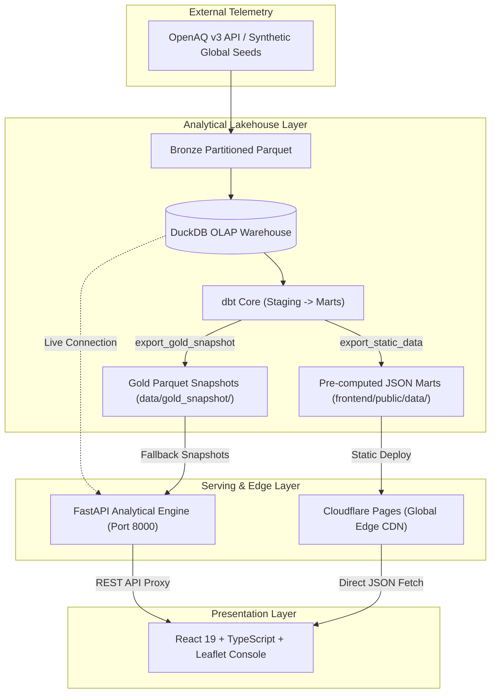

# AirPulse: Global Air Quality Risk Intelligence

[](https://opensource.org/licenses/MIT)
[]()
[](https://www.python.org/)
[](https://duckdb.org/)
[](https://www.getdbt.com/)
[](https://fastapi.tiangolo.com/)
[](https://pages.cloudflare.com/)

AirPulse is an end-to-end, open-source data engineering platform that ingests global atmospheric telemetry from the OpenAQ v3 API, stores raw partitions in a bronze Parquet lakehouse, transforms data using DuckDB and dbt Core with SCD Type 2 dimension snapshots, and serves a high-performance React + Leaflet operational risk console.

Designed as an enterprise-grade decision support system, AirPulse features **Freight & Flight Route Risk Corridor Triage** for aviation dispatchers, cargo operators, and supply chain managers evaluating atmospheric chokepoints and ground safety advisories worldwide.

## Key Capabilities

- **Freight & Flight Route Corridor Triage**: Spherical Great-Circle geodesic distance calculations ($km$ and $NM$), 40-waypoint flight-path interpolation (computed in application logic via Haversine and Slerp geometry), and automated ramp crew PPE advisories between 26 global hubs.
- **Geospatial Risk Telemetry**: Interactive Leaflet world map color-coded by EPA AQI risk tiers with dynamic sizing.
- **SCD Type 2 Dimensional Tracking**: Tracks historical station configurations, coordinates, and validity windows across 6 continents using `dbt snapshot`.
- **Hourly Trend Drilldowns**: Multi-pollutant analysis ($PM_{2.5}$, $PM_{10}$, $O_3$, $NO_2$) across 48-hour monitoring windows.
- **Operational Alerts & Export**: Filtered risk triage feeds with one-click CSV export for dispatchers.
- **Dual-Mode Deployment**: Runs as a full-stack local FastAPI application or as a **100% free, zero-maintenance Jamstack app on Cloudflare Pages**.

## Architecture



## Tech Stack

| Layer | Technology | Purpose |
| --- | --- | --- |
| **Source** | OpenAQ v3 API | Worldwide air-quality measurements across 26 international hubs |
| **Ingestion** | Python, requests, tenacity, pydantic | API extraction, rate-limit backoff, schema validation |
| **Storage** | Parquet, DuckDB | Partitioned bronze storage & embedded columnar OLAP warehouse |
| **Transformation** | dbt Core, dbt-duckdb | Dimensional modeling, SCD Type 2 tracking, data quality tests |
| **Orchestration** | Dagster / Pipeline Runner | Asset dependency graph, automated batch execution |
| **API Backend** | FastAPI, Uvicorn, Pandas | High-concurrency REST endpoints, Swagger documentation |
| **Frontend** | React, TypeScript, Vite, Tailwind, Leaflet | Geospatial flight corridor maps & telemetry console |
| **Edge Hosting** | Cloudflare Pages, GitHub Actions | Zero-cost static CDN hosting with automated CI/CD data refresh |
| **Quality** | pytest (58 tests), dbt tests, Ruff, Black, oxlint | Unit, schema, integration, Python format & TS lint verification |

## Quickstart (Local Development)

### 1. Run Everything in One Command
```bash
npm run dev
```
Starts both the FastAPI analytical backend (`http://localhost:8000`) and the Vite React console (`http://localhost:5173`) in a single terminal.

### 2. Or Run With Only Python (Zero Node Required)
Because the production bundle is pre-compiled in `frontend/dist`, you can run the entire system with pure Python:
```bash
python -m uvicorn app.api.main:app --port 8000
```
Open **`http://localhost:8000`** in any browser.

---

## Zero-Cost Cloudflare Pages Deployment Guide

AirPulse can be deployed to **Cloudflare Pages** for **100% free forever** with zero server costs:

1. **Fork or Push this repository to your GitHub account**.
2. Go to the [Cloudflare Dashboard](https://dash.cloudflare.com/) > **Workers & Pages** > **Create application** > **Pages** > **Connect to Git**.
3. Select the `airpulse-air-quality-pipeline` repository.
4. Configure Build Settings:
   - **Framework preset**: `Vite`
   - **Build command**: `npm run build --prefix frontend`
   - **Build output directory**: `frontend/dist`
5. Click **Save and Deploy**. Your interactive platform will be live globally at `https://<your-project>.pages.dev` in under 60 seconds!

> [!TIP]
> The included GitHub Actions workflow (`.github/workflows/deploy.yml`) runs tests and automatically refreshes analytical data snapshots on a 6-hour cron schedule.

## Repository Structure

```text
.
├── ingestion/                 # OpenAQ client, schemas, location and measurement extraction
├── warehouse/                 # DuckDB connection, raw loader, pipeline runner, snapshot exporter
├── dbt_project/               # staging, intermediate, mart models, macros, tests, snapshots
├── orchestration/             # Dagster assets, schedules, checks, definitions
├── app/                       # FastAPI analytical engine and data access layer
├── frontend/                  # React 19 + Leaflet + Tailwind CSS console & Pages Functions
├── data/gold_snapshot/        # Committed mart snapshots for zero-setup portability
├── tests/                     # pytest unit, integration, API, and pipeline tests
├── scripts_dev/               # synthetic bronze & global telemetry seed generators
└── .github/workflows/         # CI and scheduled refresh workflows
```

## Data Pipeline

### 1. Ingest locations

`ingestion/extract_locations.py` pulls location and sensor metadata from OpenAQ.

For scheduled refreshes, it keeps the pipeline fast by selecting useful locations per country:

```bash
python -m ingestion.extract_locations --limit-locations-per-country 10
```

The selection prefers:

- fixed monitoring stations
- non-mobile locations
- recently active locations
- moderate sensor coverage
- locations that avoid huge duplicate sensor lists

### 2. Ingest measurements

`ingestion/extract_measurements.py` reads the latest location snapshot and fetches hourly measurements for selected sensors.

For scheduled refreshes, each location is capped to a diverse set of pollutant sensors:

```bash
python -m ingestion.extract_measurements --max-sensors-per-location 5
```

Preferred pollutants:

```text
pm25, pm10, no2, o3, so2, co
```

This keeps all target countries represented while avoiding thousands of slow API calls from one overly sensor-heavy location.

### 3. Store bronze data

Ingested files land as partitioned Parquet:

```text
data/bronze/locations/ingest_date=YYYY-MM-DD/locations.parquet
data/bronze/measurements/ingest_date=YYYY-MM-DD/measurements.parquet
```

Bronze data is regenerable and gitignored.

### 4. Load raw DuckDB tables

```bash
python -m warehouse.load_raw
```

This creates:

```text
raw.locations
raw.measurements
```

The raw loader intentionally does not clean or deduplicate data. Raw stays raw; transformation logic belongs in dbt.

### 5. Transform with dbt

The dbt project builds a dimensional model:

```text
staging       -> clean, type-cast, flatten, deduplicate
intermediate  -> normalize units, calculate AQI
marts         -> dashboard-ready fact and dimension tables
```

Important mart tables:

```text
mart.fact_air_quality_hourly
mart.fact_daily_city_aqi
mart.dim_location
mart.dim_pollutant
```

Run dbt manually:

```bash
cd dbt_project
cp profiles.yml.example profiles.yml
export DBT_PROFILES_DIR=$(pwd)
dbt build
```

`dbt build` runs models, snapshots, and tests in dependency order.

### 6. Export gold snapshot

```bash
python -m warehouse.export_gold_snapshot
```

This exports final mart tables to:

```text
data/gold_snapshot/
```

These Parquet snapshots provide an offline fallback for the local FastAPI server and automated test suites without requiring a live DuckDB file.

### 7. Export pre-computed static JSON (Jamstack / Edge)

```bash
python -m warehouse.export_static_data
# or: npm run export:static
```

This exports pre-aggregated analytical datasets directly into `frontend/public/data/`:

```text
frontend/public/data/
├── kpis.json             # Top-line metrics & country counts
├── locations.json        # Station metadata & monitoring status
├── map_stations.json     # Geospatial coordinates & risk radius
├── latest_aqi.json       # Daily station AQI and risk tiers
├── alerts.json           # Categorized risk alerts by EPA tier
├── trends.json           # 48-hour hourly trend index
└── unmonitored.json      # Station coverage gap reporting
```

These static JSON files are bundled during `npm run build` to power the zero-cost Cloudflare Pages Jamstack deployment without requiring any server-side database.

## Web Dashboard & Serving Architecture

AirPulse supports two operational serving modes:

1. **Edge Jamstack (Cloudflare Pages - Production):**
   - The React 19 + TypeScript SPA and serverless Cloudflare Pages Functions (`frontend/functions/api/`). Zero server costs, zero maintenance, sub-second global CDN response.
2. **Local Full-Stack (FastAPI + React):**
   - FastAPI backend (`app/api/main.py`) serving the React SPA. Connects directly to `airpulse.duckdb` (or falls back to `data/gold_snapshot/` or Cloudflare R2).

### Run Modern Web App (FastAPI + React)

Run in the project root:

```bash
npm run dev
```

This single command starts both:
1. **FastAPI backend** on `http://127.0.0.1:8000` (auto-reloading on Python changes)
2. **Vite React UI** on `http://localhost:5173` (hot module replacement with API proxying)

- **Web Dashboard:** [http://localhost:5173](http://localhost:5173) (or [http://localhost:8000](http://localhost:8000))
- **Interactive API Docs:** [http://localhost:8000/docs](http://localhost:8000/docs)

To run the production build in a single process:
```bash
npm run build
npm start
```

### Pages & Capabilities

- **Global Overview:** Top-line operational KPIs, interactive global station risk map with EPA color codes, and today's most polluted stations leaderboard.
- **Flight & Freight Corridor Triage:** Origin-to-destination route risk scoring, great-circle Haversine distance ($km$ and $NM$), 40-waypoint flight path interpolation, and ramp-crew PPE alerts.
- **City Trends:** Drill into any location and pollutant to inspect hourly AQI progression against EPA reference threshold lines.
- **Operational Alerts:** Instant risk-tier threshold filtering with one-click CSV export for dispatch teams.

The backend serving layer supports automatic dual data modes:

| Mode | When Used | Source |
| --- | --- | --- |
| Live DuckDB | Running locally with `airpulse.duckdb` present | `mart.*` analytical tables |
| Snapshot Fallback | Deployed or without local database file | `data/gold_snapshot/*.parquet` |

This is handled seamlessly in `app/utils/data.py`.

## Setup

Prerequisites: **Python 3.9 – 3.12** and **Node.js 18+**.

### 1. Python Environment Setup

```bash
python -m venv .venv
source .venv/bin/activate
pip install -r requirements.txt
```

### 2. Frontend Dependencies Setup

```bash
npm install
npm install --prefix frontend
```

### 3. Environment Variables

Create your local environment file:

```bash
cp .env.example .env
```

Then edit `.env`:

```text
OPENAQ_API_KEY=your-openaq-api-key-here
```

*(If you don't have an OpenAQ key, AirPulse automatically falls back to generating a realistic 25-station global seed across 6 continents).*

Do not commit `.env`. It is intentionally ignored by Git.

## Run the Pipeline Locally

Fast practical run:

```bash
python -m ingestion.extract_locations --limit-locations-per-country 10
python -m ingestion.extract_measurements --max-sensors-per-location 5
python -m warehouse.load_raw

cd dbt_project
cp profiles.yml.example profiles.yml
export DBT_PROFILES_DIR=$(pwd)
dbt build
cd ..

python -m warehouse.export_gold_snapshot
python -m warehouse.export_static_data
```

Or run the unified pipeline runner in a single command:
```bash
npm run pipeline         # Auto-detects OpenAQ API key; uses seed if absent
npm run pipeline:live    # Forces live OpenAQ extraction
```

## Run Tests & Quality Checks

### Python Verification (Pytest, Ruff, Black)
```bash
python -m pytest tests/ -v
python -m ruff check app ingestion orchestration scripts_dev tests warehouse
python -m black --check --line-length 110 app ingestion orchestration scripts_dev tests warehouse
```

### Frontend Verification (TypeScript, Oxlint, Vite Build)
```bash
npm run lint --prefix frontend    # Runs oxlint
npm run build --prefix frontend   # TypeScript compilation & production bundle check
```

Current local verification:

```text
58 pytest tests passing (100% coverage across ingestion, warehouse, dbt, R2, and API)
29 dbt data tests covered through integration paths
Ruff passing
Black format check passing
oxlint (frontend) passing with 0 warnings
```

## GitHub Actions Workflows

AirPulse maintains three specialized GitHub Actions workflows:

| Workflow | Path | Trigger | Responsibilities |
| --- | --- | --- | --- |
| **Pull Request CI** | `.github/workflows/ci.yml` | Push & PR to `main` | Runs Ruff linting, Black formatting, and the complete 60-test pytest suite. |
| **Cloudflare Jamstack** | `.github/workflows/deploy.yml` | Push/PR & 6-hr cron | Runs pytest, executes `warehouse.export_static_data`, installs Node 20, and compiles `frontend/dist/`. |
| **Scheduled Data Refresh** | `.github/workflows/scheduled_refresh.yml` | 6-hour cron schedule | Pulls live OpenAQ data, loads raw DuckDB, runs `dbt build`, and exports gold snapshots. |

The scheduled telemetry refresh uses:

```bash
python -m ingestion.extract_locations --limit-locations-per-country 10
python -m ingestion.extract_measurements --max-sensors-per-location 5
```

This keeps refreshes fast and strictly within OpenAQ v3 free-tier rate limits (5 req/sec, 5,000 req/day).

To enable scheduled live refreshes, add this repository secret:

```text
Settings -> Secrets and variables -> Actions -> New repository secret

Name: OPENAQ_API_KEY
Value: your OpenAQ API key
```

## Data Quality

The project includes data quality checks at multiple layers:

- Pydantic validation for OpenAQ API response shapes
- dbt schema tests for keys, relationships, not-null fields, and accepted values
- dbt singular tests for AQI range, duplicate sensor readings, and impossible concentrations
- pytest integration tests for ingestion, raw loading, orchestration, and dashboard rendering
- Parameterized SQL execution preventing SQL injection across warehouse query boundaries
- Multi-format unit matching supporting UTF-8 (`µg/m³`) and ASCII (`ug/m3`, `ug/m^3`) telemetry
- Country-scoped window partitioning (`country_code`, `city_name`) preventing cross-border aggregation collisions
- Negative sensor drift baseline suppression in staging and AQI conversion macros

## Orchestration With Dagster

Run locally:

```bash
export PYTHONPATH=.
export DAGSTER_HOME=.dagster_home
mkdir -p "$DAGSTER_HOME"
dagster dev -m orchestration.definitions
```

Dagster represents the pipeline as assets:

```text
raw_locations
raw_measurements
raw_schema_loaded
dbt models and snapshots
```

The dbt asset wrapper runs `dbt build`, so models, snapshots, and tests execute in the correct dependency order.

## Deployment Options

### Option 1: Zero-Cost Jamstack on Cloudflare Pages (Recommended)

1. **Build & Export Static Assets**:
   ```bash
   python -m warehouse.export_static_data
   npm run build --prefix frontend
   ```
2. **Deploy to Cloudflare Pages**:
   - Connect your GitHub repository to Cloudflare Pages.
   - **Framework Preset**: `Vite`
   - **Build Command**: `npm run build --prefix frontend`
   - **Build Output Directory**: `frontend/dist`
   - The CI workflow (`.github/workflows/deploy.yml`) automatically builds and verifies these distribution artifacts.

### Option 2: Full-Stack Container / Server (FastAPI + React)

Run behind any reverse proxy (Nginx, Caddy, Traefik) or in Docker:
```bash
npm run build --prefix frontend
uvicorn app.api.main:app --host 0.0.0.0 --port 8000
```
FastAPI serves both the REST API endpoints and the compiled React SPA static assets from `frontend/dist`.

---

## Design Decisions & Technical Tradeoffs

### 1. SCD Type 2 Dimension Tracking vs. Point-in-Time Fact Joins
- **Snapshot Engine**: Station metadata evolution (relocations, sensor additions, parameter updates) is tracked via `dbt snapshot` (`snapshots/snap_locations.sql`) with `dbt_valid_from` and `dbt_valid_to`.
- **Serving Performance**: The hourly fact table (`fact_air_quality_hourly`) joins against `dim_location` (representing latest station state) to enable sub-second aggregations without costly date-range inequality joins. For retrospective audits, historical station states can be queried directly from `snapshots.snap_locations`.

### 2. Geospatial Routing Engine Architecture
- **Zero-Dependency Portability**: Haversine geodesic distance ($km$ / $NM$) and 40-waypoint spherical linear interpolation (slerp) are implemented in pure Python (`app/api/main.py`) and TypeScript (`frontend/src/api.ts`).
- **Why Not DuckDB Spatial?**: DuckDB's `spatial` extension requires loading pre-compiled C++ platform binaries (`INSTALL spatial; LOAD spatial;`), which introduces cross-platform friction in lightweight environments and serverless edge functions. Pure mathematical spherical interpolation provides identical accuracy with zero external dependencies.

### 3. Version Control & Snapshot Storage Strategy
- **Zero-Infrastructure Portability**: Committing gold snapshots (`data/gold_snapshot/*.parquet`) enables instant local execution, test suite verification, and static Jamstack generation without requiring live database access or third-party cloud credentials.
- **Enterprise Scaling**: In high-throughput enterprise pipelines refreshing every few minutes, binary Parquet snapshots should be routed to object storage (AWS S3, Cloudflare R2) or managed via Git LFS / GitHub Release assets to prevent `.git` repository bloat.

### 4. API Rate Limiting & Sampling Strategy
- **OpenAQ v3 Free-Tier Guardrails**: Ingestion caps (`--limit-locations-per-country 10`, `--max-sensors-per-location 5`) are deliberate architectural guardrails designed to respect OpenAQ's free-tier rate limits (5 req/sec, 5,000 req/day) across 26 countries without triggering HTTP 429 throttling.
- **Enterprise Uncapping**: Organizations with commercial OpenAQ API keys or internal sensor networks can remove these limits by passing `--limit-locations-per-country 0` (unlimited) or running the global telemetry generator (`scripts_dev/generate_global_seed.py`).

### 5. Instantaneous 1-Hour AQI vs. EPA Rolling Windows
- **Operational Triage Design**: Official EPA regulatory standards define AQI over 24-hour rolling averages ($PM_{2.5}, PM_{10}$) or 8-hour rolling averages ($O_3$). AirPulse calculates instantaneous 1-hour AQI approximations to provide real-time chokepoint advisories for aviation and logistics teams.
- **Tradeoff**: Instantaneous 1-hour readings are sensitive to transient local spikes (e.g. airport ground vehicle exhaust). For regulatory compliance, standard 24-hr or NowCast rolling aggregates can be added via dbt window functions.

### 6. Pipeline Resilience & Fault Tolerance
- If the live OpenAQ API encounters network timeouts or rate-limiting during scheduled execution, `warehouse.pipeline_runner` preserves the last healthy bronze partition and falls back to committed gold snapshots, preventing downstream dbt models and serving applications from failing.

---

## Project Status

Complete, verified, and active:

- Ingestion: OpenAQ v3 API extraction with rate-limit backoff & offline fallback generator
- Storage: Bronze Parquet partitioned lakehouse & DuckDB columnar warehouse
- Modeling: dbt Core dimensional models (Staging, Intermediate, Marts) with SCD Type 2 tracking
- Metrics: Multi-pollutant EPA AQI calculation, unit normalization, and parameterized SQL
- Geospatial: Haversine distance, 40-waypoint slerp flight corridor interpolation, and Leaflet risk map
- Serving: Decoupled FastAPI backend & zero-cost Cloudflare Pages Jamstack deployment
- CI/CD: 58 pytest tests passing, oxlint frontend linting, Ruff, Black, and 3 automated GitHub workflows

