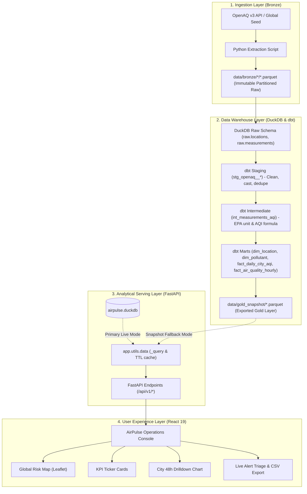

# AirPulse: Full System Documentation

A comprehensive guide explaining the **What**, **Why**, and **How** of the AirPulse Global Air Quality Risk Intelligence Platform, complete with technical architecture, SQL data models, API payloads, and real-world examples.

---

## 1. WHAT is AirPulse?

### 1.1 The Core Problem
Global logistics operators, dispatch teams, and city planners face an operational challenge:
> **"Which monitored locations currently experience hazardous air quality, what pollutants are driving the risk, and how is that risk trending over time?"**

Ground-level air pollution (PM2.5, PM10, Ozone, NO2) causes ground stop delays, port equipment maintenance triggers, worker safety hazards, and supply chain disruptions. Traditional monitoring solutions are either clunky government portals with no API, or expensive enterprise SaaS platforms.

### 1.2 The Solution
AirPulse is an enterprise-grade, end-to-end data platform that:
1. **Ingests** global sensor data from the OpenAQ v3 network (or generates realistic global telemetry).
2. **Stores** raw observations in an immutable lakehouse Bronze layer (Parquet).
3. **Transforms & Standardizes** raw concentrations into standardized EPA Air Quality Index (AQI) values via **dbt** and **DuckDB**.
4. **Serves** analytical metrics via a high-performance **FastAPI** REST engine.
5. **Visualizes** global risk on a modern **React 19 + Leaflet** geospatial operations console.

---

## 2. WHY Was It Designed This Way? (Design Decisions & Tradeoffs)

| Architectural Decision | Chosen Solution | Alternative Considered | Why This Choice? (Senior Engineering / Ponytail Rationale) |
|---|---|---|---|
| **Analytical OLAP Engine** | **DuckDB** (in-process columnar) | PostgreSQL / Snowflake | DuckDB executes vectorized columnar queries directly on Parquet files with microsecond latency, zero cloud costs, and zero external daemon management. |
| **Data Transformation** | **dbt Core (dbt-duckdb)** | Custom Python scripts | Declarative SQL models, automated DAG dependency resolution, built-in schema testing (`unique`, `not_null`, `relationships`), and auditability. |
| **Portability Layer** | **Gold Parquet Snapshots** | Mandatory live database connection | By exporting mart tables to `data/gold_snapshot/*.parquet`, anyone can clone the repo and launch the app in 1 second with zero seed/import steps. |
| **Backend Serving** | **FastAPI** | Streamlit Python Monolith | Streamlit re-executes the entire Python script on every user click, creating lag. FastAPI delivers sub-10ms JSON responses, clean OpenAPI docs, and multi-client support. |
| **Frontend UI** | **React 19 + Leaflet** | PyDeck / Plotly | Leaflet delivers smooth hardware-accelerated 60fps pan/zoom, custom SVG status markers, and instant tab transitions without page reloads. |
| **Production Packaging** | **Single-Process SPA Mount** | Separate Nginx + Node + Python containers | FastAPI serves the pre-compiled `frontend/dist/` bundle at `/`. A single process powers both the API and UI. |

---

## 3. HOW Does It Work? (End-to-End Walkthrough with Examples)



---

### Step 1: Bronze Ingestion

Raw sensor data is extracted and partitioned by ingestion date.

#### Example Raw Sensor JSON (OpenAQ format):
```json
{
  "id": 8118,
  "name": "New Delhi",
  "timezone": "Asia/Kolkata",
  "country": {"id": 9, "code": "IN", "name": "India"},
  "coordinates": {"latitude": 28.6469, "longitude": 77.3160},
  "sensors": [
    {
      "id": 811801,
      "name": "pm25 sensor",
      "parameter": {"id": 2, "name": "pm25", "units": "µg/m³"}
    }
  ]
}
```

#### How to run ingestion:
```bash
# Offline mode (generates 26 global cities without any API key):
python -m scripts_dev.generate_global_seed

# Live mode (fetches real-time measurements from OpenAQ v3):
python -m ingestion.extract_locations --countries US IN GB JP
python -m ingestion.extract_measurements --max-sensors-per-location 4
```

---

### Step 2: dbt Dimensional Modeling & AQI Calculation

Raw data is transformed through three stages:
1. **`staging`**: Flattens nested JSON, deduplicates records, and enforces timestamps.
2. **`intermediate`**: Converts raw pollutant units into EPA standard units and computes AQI piecewise breakpoints.
3. **`marts`**: Star schema with dimensions (`dim_location`, `dim_pollutant`) and facts (`fact_air_quality_hourly`, `fact_daily_city_aqi`).

#### How AQI is Calculated in SQL (`macros/calculate_aqi.sql`):
```sql
-- Standard US EPA Linear Interpolation Formula:
-- AQI = ((I_high - I_low) / (C_high - C_low)) * (C - C_low) + I_low

case
    -- PM2.5 Breakpoints (ug/m3)
    when {{ parameter_name }} = 'pm25' then
        case
            when {{ value }} <= 12.0  then round(((50 - 0) / (12.0 - 0.0)) * ({{ value }} - 0.0) + 0)
            when {{ value }} <= 35.4  then round(((100 - 51) / (35.4 - 12.1)) * ({{ value }} - 12.1) + 51)
            when {{ value }} <= 55.4  then round(((150 - 101) / (55.4 - 35.5)) * ({{ value }} - 35.5) + 101)
            when {{ value }} <= 150.4 then round(((200 - 151) / (150.4 - 55.5)) * ({{ value }} - 55.5) + 151)
            when {{ value }} <= 250.4 then round(((300 - 201) / (250.4 - 150.5)) * ({{ value }} - 150.5) + 201)
            else round(((500 - 301) / (500.4 - 250.5)) * ({{ value }} - 250.5) + 301)
        end
    ...
```

---

### Step 3: Analytical REST API (FastAPI)

FastAPI queries DuckDB directly using thread-safe read-only connections and TTL memory caching.

#### Key Endpoints & Payloads

#### 1. Topline KPIs (`GET /api/v1/kpis`)
```bash
curl -s http://localhost:8000/api/v1/kpis
```
**Example Response:**
```json
{
  "locations_monitored": 26,
  "worst_current_reading": {
    "location_key": "cc949dbf67d8ca3efce041c97706fdff",
    "location_name": "New Delhi",
    "country_name": "India",
    "parameter_name": "pm25",
    "avg_aqi": 142.0,
    "risk_tier": "Unhealthy for Sensitive Groups"
  },
  "hazardous_zones_count": 0,
  "latest_data_date": "2026-06-30",
  "data_source_label": "live DuckDB warehouse"
}
```

#### 2. Geospatial Map Stations (`GET /api/v1/aqi/map`)
Returns coordinates, peak pollutant reading, and calibrated hex colors for map markers.
```bash
curl -s http://localhost:8000/api/v1/aqi/map
```
**Example Response Snippet:**
```json
[
  {
    "location_key": "cc949dbf67d8ca3efce041c97706fdff",
    "location_name": "New Delhi",
    "country_name": "India",
    "latitude": 28.6469,
    "longitude": 77.3160,
    "parameter_name": "pm25",
    "avg_aqi": 142.0,
    "risk_tier": "Unhealthy for Sensitive Groups",
    "color_hex": "#EA580C",
    "radius": 17
  },
  {
    "location_key": "d82ef941ba92c43141f4866b16259048",
    "location_name": "Tokyo Shinjuku",
    "country_name": "Japan",
    "latitude": 35.6938,
    "longitude": 139.7034,
    "parameter_name": "pm25",
    "avg_aqi": 48.0,
    "risk_tier": "Good",
    "color_hex": "#059669",
    "radius": 10
  }
]
```

#### 3. Hourly Trends Drilldown (`GET /api/v1/aqi/trends?location_key=...&pollutant_key=...`)
Returns time-series readings for charting.
**Example Response:**
```json
[
  {
    "measured_at_utc": "2026-06-30T00:00:00Z",
    "aqi": 127.0,
    "raw_value": 46.0,
    "value_ugm3": 46.0,
    "risk_tier": "Unhealthy for Sensitive Groups"
  },
  {
    "measured_at_utc": "2026-06-30T01:00:00Z",
    "aqi": 134.0,
    "raw_value": 49.2,
    "value_ugm3": 49.2,
    "risk_tier": "Unhealthy for Sensitive Groups"
  }
]
```

#### 4. Operational Alert CSV Export (`GET /api/v1/alerts/export?min_tier=Unhealthy`)
Generates an on-the-fly downloadable CSV for incident command logs.

---

### Step 4: The React 19 Frontend Console

The frontend is located under [`frontend/`](file:///Users/rahman/Downloads/airpulse-air-quality-pipeline/frontend).

* **`RiskMap.tsx`**: Renders Leaflet OpenStreetMap with CARTO Positron vector tiles, custom EPA color markers, popups, and click-to-drilldown events.
* **`Leaderboard.tsx`**: Lists top polluted stations worldwide with risk pill filters and unmonitored station badges.
* **`CityTrends.tsx`**: Location & pollutant selectors with SVG time-series charts, 24h peak indicators, and reference risk lines.
* **`Alerts.tsx`**: Operational threshold slider with live filtering and UTF-8 CSV download.

---

## 4. Operational Runbook & Commands

### 1. One-Step Pipeline Refresh
```bash
npm run pipeline
```
*Auto-detects API key: runs live OpenAQ pull if configured, or generates the rich global seed; builds dbt models and tests; exports gold Parquet snapshots.*

### 2. Launch Local Development (Hot Reloading)
```bash
npm run dev
```
*Starts FastAPI on `http://localhost:8000` and Vite dev server on `http://localhost:5173`.*

### 3. Launch Production Mode
```bash
npm start
```
*Compiles the React bundle into `frontend/dist/` and serves the full app and API from a single FastAPI server on `http://localhost:8000`.*

### 4. Run Test Suite
```bash
npm test
```
*Executes all 54 automated pytest cases spanning API routes, data loading, dbt models, and end-to-end integration.*

---

## 5. Frequently Asked Questions (FAQ)

### Q: Do I need to buy an OpenAQ API key?
**No.** The platform includes an offline global telemetry generator featuring 26 international logistics hubs across 6 continents. If you want live real-time sensor updates, OpenAQ keys are 100% free with no credit card required at [explore.openaq.org/register](https://explore.openaq.org/register).

### Q: Where does the data live?
* **Live local mode:** `airpulse.duckdb` (local embedded SQL database).
* **Snapshot portability mode:** `data/gold_snapshot/*.parquet` (portable committed columnar files).

### Q: How do I add a new city?
Add a dictionary entry in [`scripts_dev/generate_global_seed.py`](file:///Users/rahman/Downloads/airpulse-air-quality-pipeline/scripts_dev/generate_global_seed.py) (or query its ISO code in `ingestion/extract_locations.py`) and re-run `npm run pipeline`.
